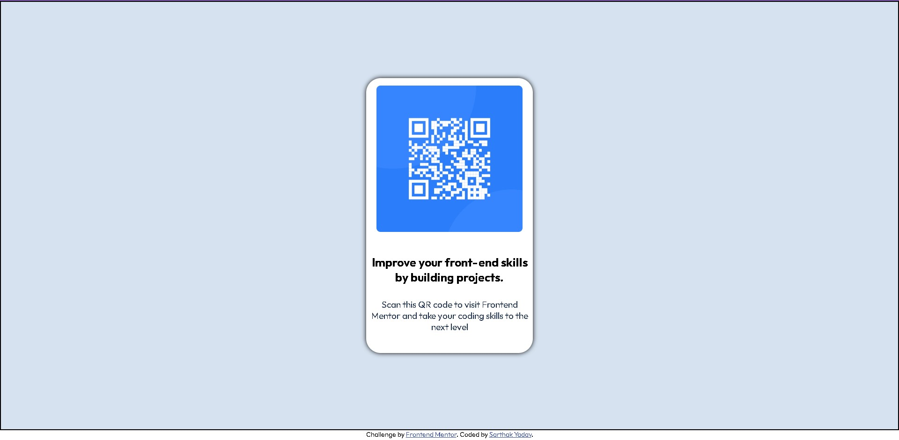

# Frontend Mentor - QR code component solution

This is a solution to the [QR code component challenge on Frontend Mentor](https://www.frontendmentor.io/challenges/qr-code-component-iux_sIO_H). Frontend Mentor challenges help you improve your coding skills by building realistic projects. 

## Table of contents

- [Overview]
  - [Screenshot](#screenshot)
- [My process]
  - [Built with]
  - [What I Learned]
  - [Continued development]
  - [Useful resources]
- [Author]

**Note: Delete this note and update the table of contents based on what sections you keep.**

## Overview

  ### Screenshot

  

### Links

- Solution URL: [Add solution URL here]

## My process

### Built with

- Semantic HTML5 markup
- CSS custom properties
- Flexbox

### What I learned

I have learned and used the following things while making this project
  1. Css Flexbox
  2. Margin and Padding
  3. Google Fonts
  4. Git and Github
  5. Basics of writing markdown files

### Continued development

After solving this challenges i have learned various things and the things that i am going to focus in future are 
  1. More about Css flexbox
  2. Css grids
  3. Using various types of font properties
  4. Hosting of website and making it Live
  5. Advanced git and github

### Useful resources

- [FrontEnd Mentor](https://www.frontendmentor.io/) - This website helped me to understand how to solve this challenge what all things are involved in the files and how to modify it and how to submit the solutions.
- [Google Fonts](https://fonts.google.com/) - This is an amazing website to download amazing fonts and put it directly into our html or css.
## Author

- Website - [Sarthak Yadav]
- Frontend Mentor - [@sarthakyadav25](https://www.frontendmentor.io/profile/sarthakyadav25)
- Twitter - [@sxrthxk](https://twitter.com/sxrthxk)
